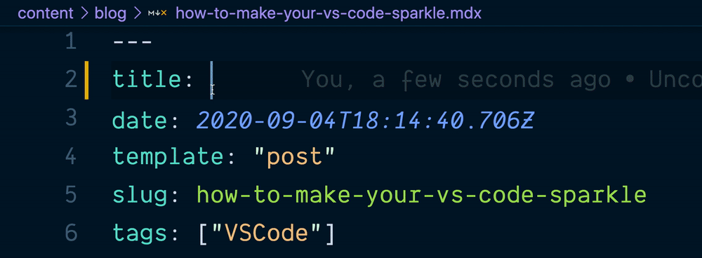

# What I have learned so far in this course

      - To google efficiently
      - To not be intimidated by computer syntax and crazy words like repository and directory.
      - How to use `Github`
      - How to use `vscode` and `the terminal`

## 1. Googling efficiently

### I have realized that a computer programer is more of a problem solver than a coder

- First of all, if you cant google then you are done fore. Because there is no
  way in hell that you will ever be able to solve every problem you find by
  yourself. Do you know why? It is because in this field u can never truly be a
  master but a good student for you will be **learning everyday for the rest of
  your life**.
- The second reason is the fact that what you do to day will be very different
  from what you did yesterday.It is true, your environment will change all the
  time and it will be up to you to keep up with it. And what is the best way you
  can be up-to-date all the time, **GOOGLE**.

## 2. Brushing of Intimidation

### Programers use way too complicated words

- **repository, directory,source-code** these words are to the person hearing
  them the first tim as intimidating as scorching hot fire is for a child
  touching it for the first time.
- But once you understand what they mean you realized that the hos scorching red
  fire used correctly can cook all your favorite food and make your life super
  easy. I mean the discovery of fire is literally the greatest discovery ever
  made buy man till this time.

## 3. How to use GITHUB

- It is interesting the idea of git and git hub. It is a genius idea to be
  honest, its basically creating an alternating universe or a parallel universe
  where u get to experiment with crazy ideas with out messing with the original
  universe or earth-1.
- Basically what u need to do is clone the project that u want to create a new
  version of. Then you create a branch so that u can experiment your ideas
  without messing up with the main branch. and the command used are in an order
  `git clone`, `git branch`, `git status`, `git add`, `git commit -m`,
  `git pull origin main`and `git push`.

## How to use VScode

- VS code is a must have tool for every single coder alive. It makes coding so
  much easier for you. One of the main reasons is the fact that it has a very
  large community, which make it possible to have a huge stream of very useful
  extensions possible. One of the best extensions we use are `prettier` and
  `live-share`

- The terminal for me is by far the most interesting part of coding. I love
  operating with it, in fact it has gotten to appoint where I am opening my
  document using the terminal for everyday tasks. Some of the best commands that
  I really love is `tree`, `ls`.
